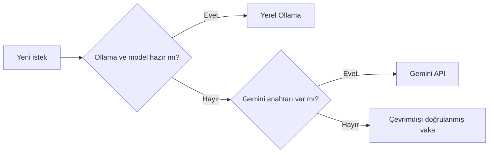

# SherlockAI — Karanlık Dosya

> Her yalan bir iz bırakır.

SherlockAI, 1900'lerin başındaki İstanbul'da geçen, tamamen Türkçe ve yapay zekâ destekli sinematik bir detektiflik oyunudur. Mekânları ara, fiziksel kanıtları birleştir, şüphelileri sorgula ve tek suçlama hakkınla vakayı çöz.


## Neler var?

- Dört sorgu odası, dört araştırılabilir mekân ve görsel kanıt masası
- Katil, gizli bilgi ve çözümü tarayıcıdan saklayan sunucu taraflı oyun durumu
- Türkçe kaynakları kullanan hafif ve tamamen yerel RAG
- Pydantic JSON şemasıyla doğrulanan yapay zekâ vakaları
- Ollama, Gemini API ve yapay zekâsız güvenli kip arasında otomatik geçiş
- Süre, puan, kanıt ilerlemesi, ilişki ağı ve Zihin Odası

| Şüpheliler | Olay yerleri |
|---|---|
|  |  |

| Kanıt masası | Zihin Odası |
|---|---|
|  |  |

Altı ana görsel oyunun karakterleri, mekânları ve renk dünyası için özgün olarak üretildi.

## Bir kez çalıştırıp arayüzü görmek

Ollama veya API anahtarı gerekmez. Python 3.10+ yeterlidir:

```bash
cd /Users/cigdemgokdas/Desktop/SherlockAi
chmod +x scripts/run_macos.command
./scripts/run_macos.command
```

İlk çalıştırmada `.venv` oluşturulur ve küçük Python bağımlılıkları kurulur. Ardından [http://127.0.0.1:8000](http://127.0.0.1:8000) adresini aç. Kapatmak için Terminal'de `Control + C` kullan.

Bu durumda oyun, elde doğrulanmış yerleşik vakayla eksiksiz çalışır. Yapay zekâ yalnızca yeni vaka ve serbest karakter cevapları için gereklidir.

## Yapay zekâ kipleri

Varsayılan `auto` sırası şöyledir:



`.env.example` dosyasını `.env` olarak kopyalayarak davranışı değiştirebilirsin:

```bash
cp .env.example .env
```

`AI_PROVIDER` değerleri: `auto`, `ollama`, `gemini`, `offline`.

### MacBook Air'da Ollama

Apple Silicon ve 8 GB bir MacBook Air için en rahat başlangıç modeli `qwen3:1.7b`'dir. Yaklaşık 1,4 GB model boyutuyla hızlıdır. Daha iyi anlatı kalitesi için yaklaşık 2,5 GB olan `qwen3:4b` da denenebilir; aynı anda çok uygulama açıksa daha yavaş olabilir.

```bash
ollama pull qwen3:1.7b
```

Ollama'yı açıp SherlockAI'yi yeniden başlat. `.env` içindeki önerilen ayar:

```dotenv
AI_PROVIDER=auto
SHERLOCK_MODEL=qwen3:1.7b
```

Alternatifler:

| Model | Yaklaşık indirme | Kullanım |
|---|---:|---|
| `qwen3:1.7b` | 1,4 GB | 8 GB Air için hızlı öneri |
| `qwen3:4b` | 2,5 GB | Daha iyi kurgu, biraz daha yavaş |
| `gemma3:1b` | 815 MB | En hafif seçenek |
| `gemma3:4b` | 3,3 GB | Daha ağır alternatif |

Model katalogları: [Qwen 3 etiketleri](https://ollama.com/library/qwen3/tags), [Gemma 3 etiketleri](https://ollama.com/library/gemma3/tags).

### Ollama olmadan Gemini API

Evet, Google AI Studio'dan alınan Gemini API anahtarı iyi bir alternatiftir. Kurulum veya model indirmesi istemez ve küçük bir Air'da daha hızlı yanıt verir; karşılığında istekler Google sunucularına gider ve ücretsiz katmanda güncel kota sınırları uygulanır.

1. [Google AI Studio](https://aistudio.google.com/app/apikey) üzerinden bir anahtar oluştur.
2. `cp .env.example .env` komutunu çalıştır.
3. Yalnızca yerel `.env` dosyana şunları ekle:

```dotenv
AI_PROVIDER=gemini
GEMINI_API_KEY=buraya_kendi_anahtarin
GEMINI_MODEL=gemini-3.7-flash
```

`.env` Git tarafından yok sayılır; anahtarı kaynak koda, ekran görüntüsüne veya GitHub'a koyma. Ücretsiz katmanda gönderilen veriler için Google'ın güncel veri kullanım koşullarını kontrol et; SherlockAI yalnızca kurgusal oyun verisi gönderecek şekilde tasarlanmıştır. Resmî belgeler: [API anahtarı kurulumu](https://ai.google.dev/gemini-api/docs/api-key), [fiyat ve ücretsiz katman](https://ai.google.dev/gemini-api/docs/pricing).

## RAG yaklaşımı

Kaynak veri küçük olduğu için fine-tuning yerine şeffaf ve hafif bir RAG katmanı kullanılır:

1. `data/` altındaki UTF-8 metinler bindirmeli parçalara ayrılır.
2. Türkçe durak sözcükleri ve hafif ek gövdeleme uygulanır.
3. Parçalar BM25 benzeri bir puanla sıralanır.
4. Yalnızca ilgili kısa bağlam modele verilir.
5. Üretilen vaka JSON şeması ve Pydantic ile doğrulanır.

Yeni bir `.txt` dosyasını `data/` klasörüne ekleyip uygulamayı yeniden başlatmak yeterlidir. Veri katmanını denetlemek için:

```bash
source .venv/bin/activate
python scripts/check_rag.py
```

## Proje yapısı

```text
SherlockAi/
├── .github/workflows/ci.yml  # GitHub Actions kalite kapısı
├── archive/v1-cli/         # İlk komut satırı sürümü
├── data/                   # Türkçe RAG kaynakları
├── scripts/
│   ├── check_rag.py        # Veri ve arama denetimi
│   └── run_macos.command  # macOS başlatıcısı
├── src/sherlock_ai/
│   ├── __main__.py        # Komut satırı girişi
│   ├── ai.py              # Ollama/Gemini sağlayıcıları
│   ├── api.py             # FastAPI uçları
│   ├── fallback_case.py   # Doğrulanmış çevrimdışı vaka
│   ├── game.py            # Oyun oturumları ve kurallar
│   ├── rag.py             # Türkçe bilgi getirme
│   └── schemas.py         # Veri sözleşmeleri
├── tests/                  # Uçtan uca ve sağlayıcı testleri
├── web/                    # Arayüz, etkileşimler ve görseller
└── pyproject.toml          # Paket ve araç yapılandırması
```

## Geliştirme ve doğrulama

```bash
python3 -m venv .venv
source .venv/bin/activate
python -m pip install ".[dev]"
python -m ruff check src tests scripts
python -m unittest discover -s tests -v
```

Sunucuyu geliştirici kipinde başlatmak için:

```bash
uvicorn sherlock_ai.api:app --reload
```

API belgesi sunucu açıkken [http://127.0.0.1:8000/gelistirici](http://127.0.0.1:8000/gelistirici) adresindedir.

## Güvenlik notları

- Katil ve çözüm bilgisi son suçlamadan önce istemciye gönderilmez.
- Model çıktısı doğrulanmadan oyun durumuna alınmaz.
- API anahtarı yalnızca sunucuda okunur ve API yanıtlarına eklenmez.
- Model veya ağ kullanılamazsa oyun otomatik olarak yerleşik vakaya döner.

## Sorun giderme

**“Çevrimdışı güvenli kip” yazıyor:** Bu bir hata değildir. Ollama modeli veya Gemini anahtarı bulunmadığında yerleşik vaka kullanılır.

**8000 bağlantı noktası dolu:** `uvicorn sherlock_ai.api:app --port 8010` komutunu kullan.

**Ollama modeli algılanmıyor:** `ollama list` ile model adını kontrol et ve aynı adı `.env` içindeki `SHERLOCK_MODEL` değerine yaz.

**Gemini yanıt vermiyor:** Anahtarın etkinliğini, ücretsiz kotayı ve `GEMINI_MODEL` adını Google AI Studio'dan kontrol et. Uygulama bu durumda da çökmez; yerleşik vakaya geçer.
